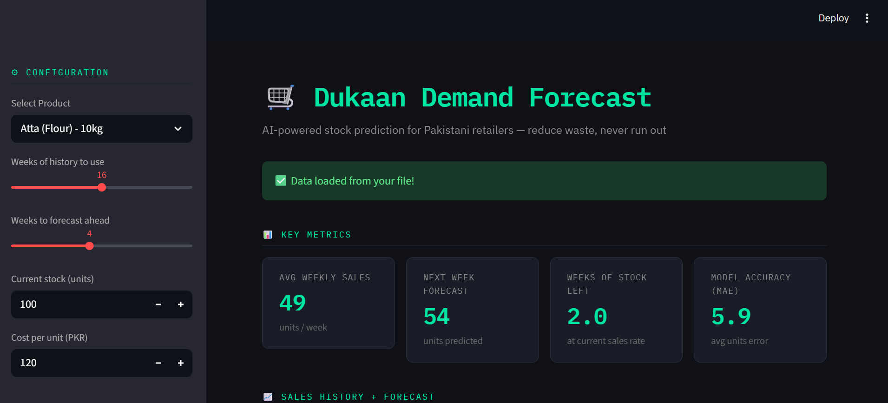

# 🛒 Dukaan Demand Forecast

> An ML-powered web app that helps Pakistani kiryana store owners predict weekly product demand — so they never over-order or run out of stock again.

[](https://dukaan-demand-forecast-3erzquza2xewjane7xfqvx.streamlit.app/)


---

## The Problem

Pakistan has over **5 million kiryana stores** in a **$150 billion** retail market. Almost all of them decide what to order based on gut feeling or waiting for a salesman to visit once a week.

The result: shelves run empty and sales are lost, or too much stock is ordered and money is wasted. This happens every single week, across millions of stores.

**Dukaan Demand Forecast gives shop owners a simple tool to make smarter ordering decisions using their own sales data.**

---

## Demo


> Select a product → set your stock and cost → click Run Forecast → get your predictions instantly.

---

## Features

- **Demand Forecasting** — predicts weekly sales up to 8 weeks ahead using Polynomial Regression
- **Confidence Bands** — shows a ±15% range so you can plan for best and worst case
- **Low Stock Alerts** — automatically flags when you're about to run out
- **Reorder Suggestions** — tells you exactly how many units to order with a safety buffer
- **Cost Estimation** — calculates total procurement cost in PKR
- **CSV Upload** — bring your own sales data for personalized forecasts
- **10 Demo Products** — built-in realistic data for common Pakistani retail items

---

## Quickstart

```bash
# 1. Clone the repo
git clone https://github.com/yourusername/dukaan-demand-forecast.git
cd dukaan-demand-forecast

# 2. Install dependencies
pip install -r requirements.txt

# 3. Run the app
streamlit run app.py
```

Open `http://localhost:8501` in your browser.

---

## Using Your Own Data

Upload a CSV file with this format:

```csv
date,units_sold
2025-01-06,45
2025-01-13,52
2025-01-20,38
```

- One row per week
- Date format: `YYYY-MM-DD`
- Minimum 8 weeks for reliable forecasts

---

## How It Works

The model uses **Polynomial Regression (degree 2)** from scikit-learn. A simple linear model isn't enough for retail data — sales curves bend with seasons, Ramadan, and long-term growth trends. A polynomial model captures that shape accurately.

Each time you run a forecast:
1. Past sales are loaded and indexed by week number
2. A polynomial pipeline is fit to the historical data
3. The model extrapolates forward for however many weeks you request
4. MAE (Mean Absolute Error) is calculated and shown so you can judge reliability

---

## Tech Stack

| | |
|---|---|
| **Streamlit** | Web UI framework |
| **scikit-learn** | Forecasting model |
| **Plotly** | Interactive charts |
| **Pandas / NumPy** | Data processing |

---

## What's Next

- [ ] Multi-product forecasting in a single view
- [ ] Ramadan and public holiday adjustments
- [ ] WhatsApp reorder alerts
- [ ] Urdu language support

---

*Inspired by [Tajir](https://www.tajir.app)'s mission to make Pakistan's retail economy more efficient.*
